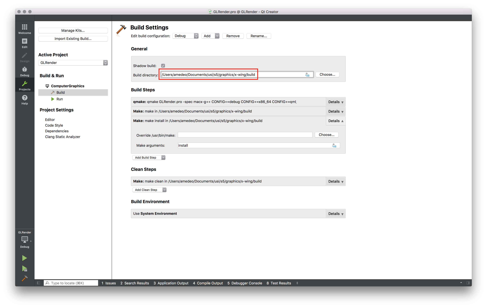
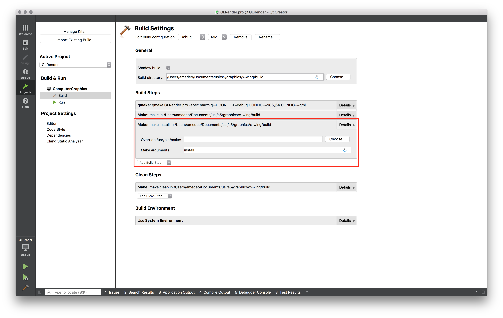

# X-wing

This project animates an X-wing and a TIE/ad starfighters from the Star Wars franchise. The two models fly in a 'eight' orbit and there are several ways to interact with the scene.

## Project structure

The projects has the following subdirectories

- `docs/`: Support files (images) for this guide
- `media/`: Models and textures used in the project
- `src/`: Code for the project

## Project configuration

The project has been developed with Qt Creator, using Qt libraries and OpenGl.

In order to compile correctly the project, in Qt Creator open the project and select `Projects` on the sidebar, then select `Build`. Change the build directory to `build` (instead of `build-GLRender-ComputerGraphics-Debug`)

Now, under `Build Steps`, select the dropdown menu `Add Build Step`, choose `Make` and put as argument `install`

Once compiled, a the executable will be available in the generated `build` directory.

## Usage

The user can interact with the scene with the following commands

- `C`: Switch from `Perspective` to `Cockpit` view and vice-versa.
- `T`: Toggle the selected starfighter. The initial selected starfighter is the X-wing, but the user can switch between X-wing and TIE, and vice-versa. This change is only apparent when `Cockpit` view is selected.
- `A`/`D`: Move camera left/right. Only available in `Perspective` view.
- `W`/`S`: Move camera frontward/backward. Only available in `Perspective` view.
- `Q`/`E`: Move camera upward/downward. Only available in `Perspective` view.
- `Left`/`Right`/`Up`/`Down`: Turn camera. Only available in `Perspective` view.
- `Space`: Shoot lasers from the selected starfighter. The lasers can be used to destroy the other starfighter. Only available in `Cockpit` view.
- `N`/`M`: Accelerate/decelerate selected starfighter. If the two starfighters collide, they will explode. Only available in `Cockpit` view.
- `U`: Destroy selected starfighter. Only available in `Cockpit` view.
- `R`: Reset the scene. It will take about one seconds.
- `1`: Set `Perspective` view to original position.

## Copyrights

The project was developed by Samuele Bischof, Alexander Fischer, Camillo Malnati, Francesco Sani and Amedeo Zucchetti for the Computer Graphics course of the Bachelor in Informatics at USI.

The two models used in this project were found on Free3D website, provided by user kim. The models are available at the following address

- https://free3d.com/3d-model/star-wars-x-wing-23129.html
- https://free3d.com/3d-model/star-wars-vader-tie-63619.html

The terrain is generated with a noise function provided by the library PerlinNoise by Ryo Suzuki.
